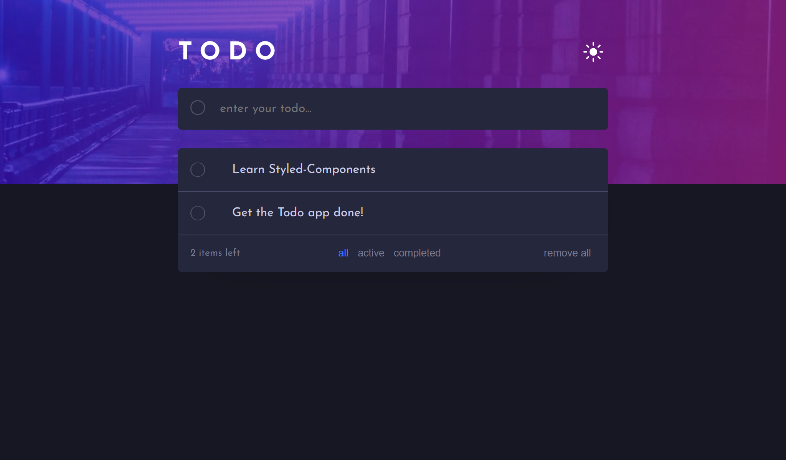

# Frontend Mentor - Todo app solution

This is a solution to the [Todo app challenge on Frontend Mentor](https://www.frontendmentor.io/challenges/todo-app-Su1_KokOW). Frontend Mentor challenges help you improve your coding skills by building realistic projects. 

## Table of contents

- [Frontend Mentor - Todo app solution](#frontend-mentor---todo-app-solution)
  - [Table of contents](#table-of-contents)
  - [Overview](#overview)
    - [The challenge](#the-challenge)
    - [Screenshot](#screenshot)
    - [Links](#links)
  - [My process](#my-process)
    - [Built with](#built-with)
    - [What I learned](#what-i-learned)
    - [Continued development](#continued-development)
  - [Author](#author)

## Overview

### The challenge

Users should be able to:

- View the optimal layout for the app depending on their device's screen size
- See hover states for all interactive elements on the page
- Add new todos to the list
- Mark todos as complete
- Delete todos from the list
- Filter by all/active/complete todos
- Clear all completed todos
- Toggle light and dark mode
- **Bonus**: Drag and drop to reorder items on the list

### Screenshot

### Links

- Solution URL: [github](https://github.com/mostafa-meerzad/todo-app.git)
- Live Site URL: [live preview](https://652c211003f1d60ed228e0fd--resonant-sprite-45f49e.netlify.app/)

## My process

### Built with

- Semantic HTML5 markup
- Flexbox
- Mobile-first workflow
- [React](https://reactjs.org/) - JS library
- [Styled Components](https://styled-components.com/) - For styles

### What I learned

- How to apply light/dark theme using styled-components
- Use redux-toolkit for a better developer experience while using redux
- How to make and pass -- attributes in order to apply different styles when using styled-components
- How to set/get data to and from the browser's localStorage  

### Continued development

That bonus **drag&drop** feature would be a good challenge for this app. I might eventually add that feature.

## Author

- Github - [mostafa-meerzad](https://github.com/mostafa-meerzad)
- Frontend Mentor - [@mostafa-meerzad](https://www.frontendmentor.io/profile/mostafa-meerzad)
- linkedIn - [mostafa-meerzad-a753371b7](https://www.linkedin.com/in/mostafa-meerzad-a753371b7)
- Instagram - [mostafa-meerzad](https://www.instagram.com/mostafameerzad/)
